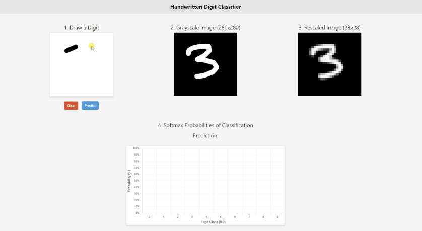
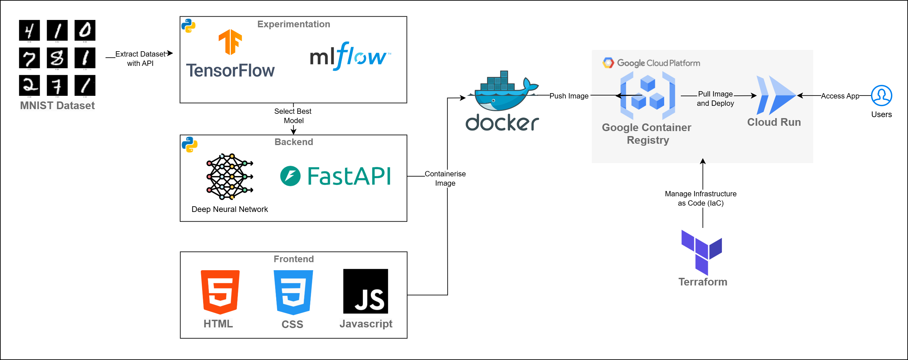

# Handwritten Digit Classifier Web App




This repository contains the code for a **Handwritten Digit Classifier Web App**. The app allows users to draw a digit on a canvas, and it returns a prediction based on a neural network model built using **TensorFlow**. The backend is powered by **FastAPI**, providing high performance and ease of development, while the frontend is developed using **HTML**, **CSS**, and **JavaScript**. Find this app at the following: [GCP Cloud Run App](https://mnist-backend-service-759393787727.australia-southeast1.run.app/)


## Architecture



## Folder Structure

```
handwritten-digit-classifier/
├── app.py                # Main entry point for the FastAPI backend
├── data/                 # Folder containing relevant images for README
├── model/                # Trained machine learning models
│   └── simple_dnn_rotation_6.h5  # Neural network model trained with rotation augmentations
├── src/                  # Source code for the backend (FastAPI)
│   └── model.py          # Code for model architecture and training
│   └── experimentation.py        # Scripts for running experiments on neural networks
│   └── extraction.py     # Extracts MNIST data from TensorFlow API
│   └── transformation.py # Data augmentation transformations applied to MNIST dataset
│   └── data_exploration.ipynb    # Jupyter notebook for exploring the dataset and running experiments
├── static/               # Frontend code (HTML, CSS, JavaScript files)
│   ├── index.html        # HTML file for the web interface
│   ├── style.css         # Custom styles for the web app
│   ├── app.js            # JavaScript logic for frontend functionality
│   └── ...               # Additional static files (e.g., images, assets) for the frontend
└── requirements.txt      # Backend dependencies (FastAPI, TensorFlow, etc.)
└── .gitignore            # Git ignore file to exclude unnecessary files from version control
```
## Features

- **Canvas for Drawing**: Users can draw a digit on the canvas.
- **Prediction**: After drawing, users can click the "Predict" button to get the predicted digit along with the probability distribution.
- **Clear Canvas**: A button to clear the drawing area and start a new prediction.
- **Probability Chart**: Visualizes the prediction probabilities using a bar chart.

## Tech Stack

### Model Development and Experimentation

In this project, we utilised **Tensorflow** and  **MLFlow** to experiment with various neural network architectures and augmentations to improve the performance of the handwritten digit classifier.

The models experimented with include:

- **Simple DNN with Rotation Augmentation (Range 6)**: This model uses a simple convolutional neural network (CNN) with a rotation range of 6 degrees for augmenting the training dataset.
- **Simple DNN with Rotation Augmentation (Range 12)**: A variation of the simple DNN model with a larger rotation range of 12 degrees for data augmentation.
- **Deep DNN with Rotation Augmentation (Range 6)**: A deeper CNN model with similar rotation augmentation applied to the training data.
- **Deep DNN with Rotation Augmentation (Range 12)**: This model uses a deeper CNN architecture and a larger rotation range for data augmentation.

MLFlow was employed for logging the experiments, tracking hyperparameters, training progress, and evaluating performance. Each model's accuracy was recorded, and the best-performing model was selected for deployment.

### Backend

- **Python**: The backend is written in Python, a powerful programming language known for its simplicity and versatility.
- **TensorFlow**: The neural network model is built using TensorFlow, a popular machine learning framework. The model is trained to recognize handwritten digits (MNIST dataset).
- **FastAPI**: A modern, fast web framework for building APIs with Python. FastAPI is used to serve the model and handle prediction requests.

### Frontend

- **HTML, CSS, JavaScript**: The frontend is built with standard web technologies, including HTML, CSS, and JavaScript.
- **Bootstrap 5**: For responsive design and easy styling.
- **Chart.js**: Used for visualizing prediction probabilities as a bar chart.

### Deployment  

-  **GCP Cloud Run**: The backend, powered by FastAPI, is deployed to **Google Cloud Run**, a fully managed platform that automatically scales the backend based on demand.  
-  **Docker**: The app is containerized using Docker for consistency and portability across environments.  
-  **Terraform**: Infrastructure management and deployment are automated using Terraform for a streamlined setup and configuration.  
-  **Google Container Registry (GCR)**: Docker images are stored and managed in **Google Container Registry (GCR)**, making it easy to deploy containers to GCP services like Cloud Run.

## Getting Started

### Prerequisites

- Python 3.11.10 or above
- Node.js and npm (for frontend dependencies)
- FastAPI for the backend

### Installation for Running Locally

1. **Clone the repository**

```bash
git clone <repo-url>
cd handwritten-digit-classifier
```

2. **Install backend dependencies**

```bash
pip install -r requirements.txt
```

3. **Install frontend dependencies**

```bash
cd web
npm install
```

4. **Run the backend server**

```bash
uvicorn app:app --reload
```
The backend will now be running, and the app should be accessible at `http://localhost:8080`.


## App Usage

- **Draw a digit**: Use the canvas to draw a digit between 0-9.
- **Predict the digit**: Click on "Predict" to get the predicted digit and its associated probabilities.
- **Clear the canvas**: Click "Clear" to reset the drawing area and prepare for a new prediction.

## License

This project is licensed under the MIT License - see the [LICENSE](LICENSE) file for details.

